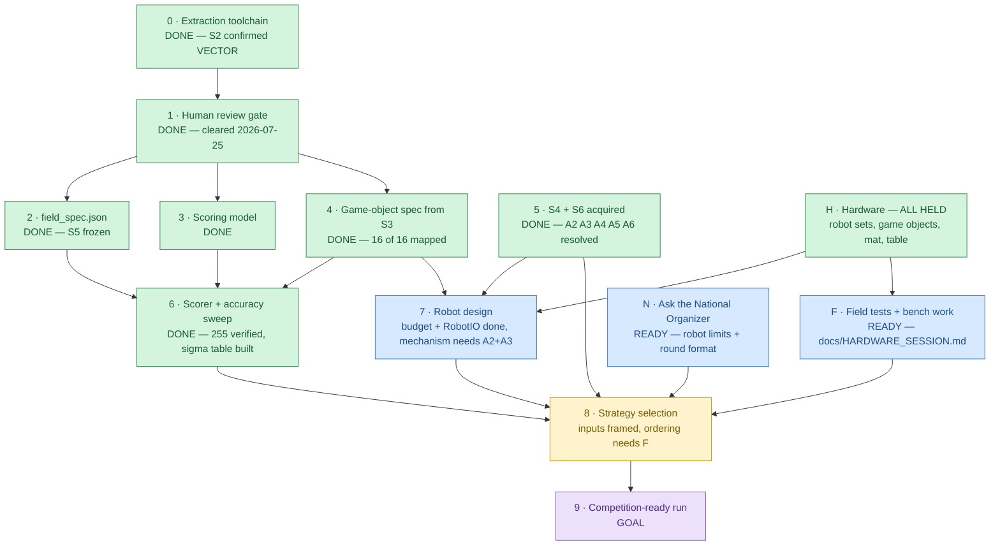

# WRO 2026 RoboMission Elementary — Roadmap

`last_reviewed: 2026-07-27 (parameter sensitivity)` · **NOTHING IS BLOCKED (ADR-025). The work order is `docs/HARDWARE_SESSION.md`; every measurement it produces has somewhere to land, and the build chain is `tools/build_all.py`.**

**Seven questions now sit ahead of every measurement** (ADR-033), and all seven are drafted in
[`docs/QUESTIONS.md`](../QUESTIONS.md), ordered by magnitude with fallbacks: five open
ambiguities for the official Q&A and two for the National Organizer. **A7 is worth 24 points**
of expected score and a 2.64× swing in required accuracy; the **tournament format** sets the
*objective function* itself, so it outranks anything the field tests can produce.

The bench-work items are **MEAS-1…5** as of 2026-07-27 — renamed from `A1`–`A5`, which collided
with ambiguities A1–A5 in a register where A4 and A5 are *resolved* entries (ADR-033).

## 0 · At a glance

| Phase | Status | What it is | Blocker |
|---|---|---|---|
| **0 · Extraction toolchain** | ✅ DONE | `tools/pdf_extract.py` (45 tests green), `docs/extracted/` for all 3 sources, `docs/EXTRACTION_REPORT.md`. **S2 confirmed VECTOR** (50,479 paths); mat measured **2361.999 × 1143.000 mm**; two runs byte-identical across 9,124 outputs | — |
| **1 · Human review gate** | ✅ DONE | extraction accepted 2026-07-25 | — |
| **2 · `field_spec.json`** | ✅ **DONE** | **S5 built** by `tools/build_field_spec.py` from `docs/area_map.toml` — no hand-written coordinates. **19 areas** (10 scoring), 6 note starts, 17 object start poses. Full-chain determinism verified. The last two are the truck's vehicle bodies, added by ADR-030 to bound where four objects start — `scoring = false`, and a bound is not a pose. | — |
| **3 · Scoring model (S1)** | ✅ **DONE** | `data/scoring_model.json` — missions, predicates, time rules, randomization. Maxima sum to 255 and `max == each × count` per rule, both tested. | — |
| **4 · Object spec (S3)** | ✅ **DONE** | `data/object_spec.json`: **all 16 objects mapped, no unresolved spans.** Boundaries re-derived from the cream **run-preview box** (ADR-019), which corrected three of part 1's page ranges and its step count. Contact footprints for every object on a containment path except the keyboard, which is **bounded** at ≤ 56 × 56 mm. **Cables measured at 128.0 mm — they do not fit across their 79.70 mm target area, so placement orientation is forced** (figure corrected 2026-07-27, ADR-021: the first published value read `bbox_mm` as the area). Parts inventory (pp. 176–177) gives canonical LEGO ids, cross-checked against the extraction | — |
| **5 · S4 + S6** | ✅ **DONE** | S4 Jan 15 2026 (31 pp) + S6 snapshot acquired 2026-07-25; A2/A3/A4/A5/A6 resolved; 43 rules cited in `docs/citations.json` | — |
| **6 · Scorer + accuracy sweep** | ✅ **DONE** | `sim/` package (ADR-020) + `data/placement_sensitivity.json`. A perfect run verifies at **255/255**, a do-nothing run at the **40-point bonus floor**. All five open interpretations (A1/A2/A5/A7/A8) are named parameters, not hard-coded readings. The sweep reports **required placement accuracy per mission** under both A7 readings — see `docs/PHASE7_CONSTRAINTS.md` §7b. Dynamics deliberately **not** modelled: its every parameter is an unmeasured `ASSUME:` until the field tests run | — |
| **F · Bench + field work** | 🔵 **READY** | `docs/HARDWARE_SESSION.md` — an ordered work order. **Block MEAS** needs no robot and closes the manipulator decision, `mass_g`, AS-6 and two bounds, plus an independent caliper check on Phase 4's whole stud-counting chain. **Block B** supplies σ, colour separation, table reality and motor characterisation | — |
| **7 · Robot design** | 🔵 **budget + `RobotIO` done / mechanism READY to close** | **Part 1** — `data/manipulator_requirements.json` + **ADR-022**: **2 drive + 0 yaw + 2 manipulator**; yaw costs nothing (measured ±31°); 8 of 12 objects share one 32 mm grip and that alone reaches **195/255 (76 %)**. **Part 2** — `robot/robot_io.py`, an intent-level contract with a simulator backend and two cited hardware backends, plus `tools/check_portability.py`, which makes the "one file runs on both" invariant **tested** rather than claimed (ADR-023). The mechanism is refused, not chosen — and is now closable by weighing the objects and finding grip points, items **MEAS-2/3** of the work order. **ADR-029 gave that decision a price:** carry capacity 1 → 2 takes **2213 mm (29 %)** off the worst-case note tour, and capacity 6 removes the randomization from the travel budget entirely — an exact zero spread, structurally, because collecting every note before delivering any visits the same point set whatever the permutation. Not a smooth trend: the spread *rises* from capacity 3 to 4, so carrying *most* of the notes buys distance without buying predictability | — |
| **H · Hardware** | ✅ **ALL HELD** | EV3 45544 · SPIKE Prime 45678 + 45681 · WRO Brick Set 45811 + Expansion 45819 · the printed mat · a competition-spec table. Recorded as a blocker from Phase 4 until 2026-07-27 on an operator answer that was never re-asked — see **ADR-025** | — |
| **8 · Strategy selection** | 🟡 **inputs framed / ordering needs σ** | `data/strategy_frame.json` — travel cost, point density and **break-even P(collision)** per mission. The field splits in two: **120 pts of notes 367–1110 mm from start risking only the 10-pt clef**, against **95 pts 2 m away risking the 30-pt stage cluster**. A note is therefore *always* worth attempting; the left-hand missions are conditional (ADR-024). `data/expected_score.json` now turns σ straight into an expected score — even at σ = 20 mm the full-attempt run expects **216/255** on the contact reading, because the partial tier makes it degrade gracefully (ADR-026). **The objective itself was then corrected (ADR-027):** S4 §10.13 makes the ranking depend on the tournament format and offers *"the best attempt out of three rounds"* as an example, so `E[score]` is the **N = 1** case, not the objective. `data/round_strategy.json` publishes the full run-score *distribution* and `E[max of N]` — at σ = 20 mm, 216 becomes **229 at N = 3**, and the premium **grows with σ**, so extra rounds reward the less precise, more ambitious strategy. Break-even `P(collision)` moves with it: `cable_upper` tolerates 0.398 across one attempt, **0.603** across three. Ordering still needs σ (**B5**) and a route (**B0**). **Travel entered the model (ADR-029):** `data/travel_budget.json` costs the six notes exactly over all 24 randomization permutations and publishes the mean speed each manipulator capacity demands inside 120 s — 63.3 mm/s at capacity 1 against 24.9 at capacity 6. It also corrected `strategy_frame.json`, whose `points_per_metre_round_trip` omitted the fetch leg and is **anti-correlated** (ρ = −0.486) with true cost at the unluckiest permutation while being exactly right (ρ = +1.000) at the luckiest. **ADR-030 then reached the whole field:** the truck is two measured bodies, so the four objects that start in it are *bounded* rather than pending, and **ten of twelve missions (185 of 215 placement points) are now costed** — 9 550–11 154 mm at capacity 2, needing **93 mm/s** before any pick-and-place time. **ADR-031 joined the pieces and lifted the ban on mission ordering** for those ten: `data/feasibility_frontier.json` says which missions fit at a given speed and handling time. **Speed saturates** (above 92.9 mm/s at instant handling, 278.8 at 8 s, more speed scores nothing) **and the instruments turn out to be σ-proof** — `backstage` is 20× a note target, so they overtake the notes at **σ = 20.4 mm**. **ADR-032 finally composed the chain**: `data/parameter_sensitivity.json` is the project's first end-to-end score (225 at the perfect corner, 40 when nothing fits) and ranks all six unmeasured parameters by how far they move it. **σ leads in 27 of 35 grid cells** — driving speed takes the top rank only at ≈ 8 s of handling per object, and there at *every* speed swept, so handling time causes that flip rather than speed. The measurement order is σ (**B5**) first with that band as the named exception | needs **B5** to pick a side of 20.4 mm; **B0** for the two cables; N is `NEEDS-VERIFY(NO-TH)` |
| **9 · Competition-ready run** | 🟪 GOAL | scored, repeatable run | needs 8 |

> **Every phase that can be done from documents is done (0–6), and nothing is blocked.** The
> hardware is held — it always was. This roadmap said otherwise from Phase 4 until 2026-07-27
> because an operator answer of *"partially / not sure yet"* was hardened into a blocker and
> never re-asked (**ADR-025**).
>
> **The highest-leverage action is `docs/HARDWARE_SESSION.md` Block MEAS — items MEAS-1 to MEAS-3.** No
> robot is needed. A scale and a pair of calipers close the manipulator mechanism decision that
> ADR-022 deliberately left open, fill in `mass_g` for all 16 objects, replace AS-6, upgrade two
> bounds to measurements, and independently check Phase 4's entire stud-counting chain. It is
> perhaps an afternoon.
>
> After that, **B5** — odometry drift — supplies σ and unblocks Phase 8's ordering.
>
> One action remains that no measurement can reach: **submit A7 to the official Q&A.** Resolving
> `completely_in` to the contact patch rather than the silhouette relaxes the note placement
> requirement from **σ ≈ 4.3 mm to σ ≈ 11.4 mm** — a factor of 2.6 on the mission carrying 120 of
> 255 points. A7 was previously recorded as "holds either way, nothing is blocked", which is true
> for feasibility and misleading for design.
>
> **And one that outranks all of them, because it decides *what* to optimise rather than how
> well: ask the National Organizer how many rounds there are and how they are aggregated**
> (**ADR-027**). S4 §10.13 makes the ranking format organizer-set and offers *"the best attempt
> out of three rounds"* only as an example. If N > 1 the objective is `E[max of N]`, which
> **rewards variance** — at σ = 20 mm, 216 becomes 229 at N = 3, and the premium *widens* as σ
> grows. A programme built to minimise σ is optimising the right quantity only if N = 1. The
> same conversation settles the robot limits, which have also never been asked.
>
> **Block MEAS got sharper (ADR-029).** Weighing the notes is no longer only about the gripper: carry
> **capacity** is worth 2213 mm off the worst-case note tour at the first extra slot, and carrying
> all six deletes the randomization from the travel budget outright. MEAS-2 and MEAS-3 now decide how much
> of that is reachable, and P6 has a speed to beat — 63.3 mm/s at capacity 1, 24.9 at capacity 6.
>
> **And sharper again (ADR-030), in a direction that reorders the work.** Ten of twelve missions
> are now costed, and the full run needs only **93 mm/s at capacity 2** — undemanding for either
> platform. What is *not* undemanding is **pick-and-place: at 12 s per object the run cannot be
> completed at any driving speed**, because ten objects × 12 s is the whole attempt. That makes
> **A3 a feasibility measurement, not a preference**, and demotes P6. It also prices **B0**: the
> unknown truck-vehicle choice is worth 2 327 mm of spread against the 999 mm the note
> randomization costs and no measurement can remove.
>
> **B5 got a threshold, not just a number (ADR-031).** σ = **20.4 mm** is where a note stops
> being worth more than an instrument: `backstage` is 20× a note target, so the instruments hold
> `p_full = 1.000` to σ = 30 mm while a note loses a third of its value. B5 therefore decides
> *which half of the field is the priority*, not merely how precisely to aim at it.
>
> **The real bottlenecks are therefore an AFTERNOON of measurement (Block MEAS) and TWO UNASKED
> QUESTIONS — A7 to the official Q&A, and the round format to the National Organizer.** No
> technical blocker exists anywhere in this repo; everything else is buildable or cleanly
> sequenced behind σ.

### Why these edges

Drawn from stated constraints, not assumed ordering:

| Structure | Where | Source of the constraint |
|---|---|---|
| **Fork** | 1 → {2, 3, 4} | geometry, scoring rules and object specs come from three *different* sources (S2 / S1 / S3) and never read each other |
| **Join** | {2, 3, 4} → 6 | a simulator needs field geometry **and** a scoring model **and** object mass/dimensions |
| **Join** | {4, 5, H} → 7 | gripper design needs object dimensions (S3) **and** robot limits (S4) **and** object mass, which only the physical objects provide; `CLAUDE.md` A6 |
| **Independent root** | H | the hardware waits on nothing and nothing in this repo substitutes for it — but it is **held**, so it gates only the doing |
| **Join** | {5, 6, 7, F} → 8 | `CLAUDE.md` §5.7 anti-pattern #3 needs the scorer (6) and #5 needs `P(success)`, which needs σ from the field tests (F) |
| **Fork** | H → {7, F} | one purchase unblocks both the manipulator and every field test; that is why it is the bottleneck rather than one blocker among several |
| **Independent root** | 5 | S4 acquisition is external/operator work — it waits on nothing in this repo |
| **Independent root** | N → 8 | S4 §10.13 makes the ranking format organizer-set, and that format *is* Phase 8's objective function (`E[score]` vs `E[max of N]`, ADR-027). It waits on nothing in this repo and no measurement substitutes for it — a separate branch, not a step in the chain. **`ready`, not `decision`**: nothing is blocked on the answer, because every figure in `data/round_strategy.json` is published against N rather than for a chosen N. Painting it red would re-import exactly the framing ADR-025 removed |
| **Gate** | 0 → 1 | session brief §6: extraction quality must be human-reviewed before geometry is frozen |

---

## 1 · Maintenance rule (living document)

Any task that closes or materially advances a phase **must reconcile this document in the
same unit of work** — the at-a-glance diagram classes, the phase table row, and
`last_reviewed`. Not as a follow-up, not "next session".

This is documentation-currency for decisions already made or explicitly authorized. It never
licenses making a new, undiscussed decision — if a change would require a *new* decision,
surface it and wait.

**The data half is enforced, not remembered.** Six files in `data/` are derived through a
dependency chain; run `uv run python tools/build_all.py` rather than the builders individually,
and `--check` before committing. `tests/test_pipeline.py` fails if any artefact pins an input
sha that no longer matches — which is what turns a mis-ordered build from a silent wrong answer
into a named one.

---

## 2 · Phase detail

### Phase 0 — Extraction toolchain ✅ DONE (2026-07-25)

Delivered: `tools/pdf_extract.py`, `tests/test_pdf_extract.py` (45 tests green),
`docs/extracted/**` for all three sources, `docs/EXTRACTION_REPORT.md`,
`docs/ASSUMPTIONS.md`.

Findings that change what downstream phases can assume:

| Finding | Effect |
|---|---|
| **S2 is VECTOR** — 50,479 paths, 0.9998 paths per painting op | phase 2 can be mm-exact; geometry is not sampling-limited |
| **Mat = 2361.999 × 1143.000 mm** from TrimBox | the `2362 × 1143` assumption is confirmed, not assumed |
| **S2 has zero bleed** (TrimBox == MediaBox) | raised a new `NEEDS-VERIFY(S4)` about a physical mat border — see phase 5 |
| **S3 is fully rasterized** — 1/177 pages with a text layer, 0 vector paths | phase 4 is visual-reading work, not parsing work. Budget accordingly. |
| S1 text + scoring tables extract cleanly (13,596 chars, GFM tables) | phase 3 is straightforward |
| S1 p13 confirms `AMBIGUITY(A1)` verbatim | the register's OR default stands |

Explicitly out of scope and **not** done: `data/field_spec.json`, fill-colour → area-ID
mapping, robot design, strategy, simulator.

### Phase 1 — Human review gate 🟥 ACTIVE

A person reads `docs/EXTRACTION_REPORT.md` and decides whether the extraction is trustworthy
enough to freeze geometry against. This gate exists because a wrong coordinate transform
produces output that looks entirely plausible.

### Phase 2 — `data/field_spec.json` ⬜

Freeze mat geometry in the MAT frame. Map the raw fill-colour inventory to canonical area
IDs — a judgement call deferred here on purpose. Freeze the `CLAUDE.md` §5.3 ID table in the
same commit.

### Phase 3 — Scoring model from S1 ⬜

Turn `CLAUDE.md` §5.6 into machine-readable rules, including the 4! = 24 note permutations
and 50 % partial credit on every mission.

### Phase 4 — Game-object spec from S3 ✅ DONE (2026-07-26)

S4 §7.4: the 2026 game elements are built from the **WRO Brick Set (45811)** and **Expansion
Set (45819)**. They are therefore LEGO System/Technic, whose geometry is a known constant —
8.00 mm stud pitch, 3.2 mm plate, 9.6 mm brick.

Dimensions are obtained by **counting studs in a page render and multiplying by 8.0**, which
is robust to raster resolution in a way measuring is not. S3 being rasterized costs far less
than the extraction report assumed.

`MEASURED(S2):` the mat uses a design unit **u = 31.9 mm**, hit six independent times
(note start square 1.0u · target inner 1.5u · target outer 2.5u · grey border 0.5u ·
mic target 2.5 × 3.0u · cable area 2.5 × 6.5u). `ASSUME:` u ≈ 4 studs (32.0 mm, 0.31 % under,
consistently).

**Delivered** across three parts — `docs/object_map.toml` + `docs/object_parts.toml`
(judgement) → `tools/build_object_spec.py` → `data/object_spec.json` (derived, deterministic):

| | |
|---|---|
| objects mapped | **16 of 16**, zero unresolved spans |
| boundary signal | the cream **run-preview** box `(255,245,218)`, 20 pages — ADR-019 |
| sub-assemblies | 6, in their own table and never in `objects` — ADR-018 |
| parts inventory | pp. 176–177, canonical LEGO ids, 426 elements, 3 cross-checks enforced by the builder |
| A7 | **CLOSED** against three independent sources |
| cable | **128.0 mm; orientation forced** — see `docs/PHASE7_CONSTRAINTS.md` §7 |

**What part 3 corrected in parts 1 and 2.** The lesson is worth more than the corrections:
part 1's boundary signal was the *parts callout*, and its caveat that the signal "degrades
after page 124" read as a limitation of the source when it was a limitation of the signal.
A better signal was present in S3 the whole time and had simply never been looked for.

| Fact | was | is | caught by |
|---|---|---|---|
| `instrument_guitar` | 114–123 | **114–125** | p124 still shows the guitar mid-build |
| `cable` | 167–172 | **167–175** | no run preview after 167 |
| `mic` | 66–72 + unresolved 73–88 | **66–88** | p72 uncapped column, p88 capped |
| `instrument_keyboard` | 89–95 + unresolved 96–101 | **89–101** | p101 shows it assembled |
| build steps | 176 (pp. 2–177) | **174 (pp. 2–175)** | pp. 176–177 are the inventory |

The step-count error is the instructive one: part 1 *verified* it with a digit census that
happened to count the inventory pages' `24x`/`3003` labels as step numbers. **A cross-check
can agree with a wrong answer if it measures the wrong thing.**

**Still open, and not solvable from S3:** `mass_g` is `null` for all 16 objects. Mass does not
appear in a building instruction — it has to be weighed. That is work order item **A2**, needs no
robot, and the objects are held (ADR-025), so it is a task rather than a blocker. The ingestion
path is live and tested inert (ADR-026).

### Phase 5 — S4 + S6 ✅ DONE (2026-07-25)

Obtain "WRO RoboMission General Rules 2026". Authoritative for robot limits, run procedure,
restarts, tie-break and table setup. Resolves A3, A4, A5, A6 and every open
`NEEDS-VERIFY(S4)` in `docs/EXTRACTION_REPORT.md`.

Phase 0 added one more, and it is the highest-consequence of the set:

> Does the competition-supplied mat carry a **border beyond the artwork trim edge**, and is
> it laid flush to the table walls? S2 declares zero bleed, so if the physical mat has an
> unprinted margin, **every** MAT-frame coordinate is offset by a constant that no internal
> consistency check could reveal. (`AS-5`)

**Closed.** S4 verified (cover `VERSION: JANUARY 15TH 2026`, 31 pages,
sha256 `90a28d8b…9e795`) and an S6 snapshot taken (content `2026-06-30T16:45:33+02:00`).
43 rules are quoted and page-referenced in `docs/citations.json`.

S6 is **live and unversioned** and sits above S4 in the hierarchy — it has already overwritten
two S4 clauses. Re-read it before any scoring or robot-limit claim, at least weekly. Change
detection diffs the per-answer tuples in `docs/s6_index.json`, never the HTTP `Last-Modified`
header (a render/cache timestamp that moved to July while the content field stayed at 30 June).

**Still open at national scope:** `NEEDS-VERIFY(NO-TH)` — S4 §4.3/§5.2 let National Organizers
change robot limits. A6 is closed internationally, not locally.

### Phase 6 — Scorer + accuracy sweep ✅ DONE (2026-07-27)

Delivered: the `sim/` package (ADR-020) — `geometry.py`, `world.py`, `scoring.py`,
`sensitivity.py` — plus `tools/run_sensitivity.py` → `data/placement_sensitivity.json`.
58 new tests.

**Two anchors pin the scorer.** A perfect run scores exactly **255/255**; a run where the
robot never moves scores exactly **40** — the bonus floor, with the clock forced to 120 s.
Between them sit the rules that a plausible implementation gets wrong, each asserted:

| Rule | Naive answer | Correct answer |
|---|---|---|
| damaged but perfectly placed note | 20 | **0** (S4 §7.7, global) |
| cable partial credit | 10 (half) | **5** (33.3 %, S1 p8) |
| both cables in one area | 30 | **15** (one per area) |
| note held by the gripper at time-out | 0 | **10** (A5, S6 2026-06-30) |
| clef toppled in place | keeps its bonus | **loses it** under A1's OR default |

**All five open interpretations are parameters**, defaulted to their register entries:
`moved_semantics` (A1) · `upright_tolerance_deg` (A2) · `held_at_timeout` (A5) ·
`footprint_reading` (A7) · `bonus_only_forces_120s` (A8). No result can be quoted without the
parameter set that produced it.

**What the sweep produced.** `P(success)` per mission across a σ grid, under **both** A7
readings, cross-checked against the closed-form slack. The headline is in
`docs/PHASE7_CONSTRAINTS.md` §7b: **A7 costs a factor of 2.6 in required placement accuracy**
(σ ≈ 11.4 mm on the contact reading against ≈ 4.3 mm on the silhouette), on the mission worth
120 of 255 points. That promotes A7 from a recorded ambiguity to the most valuable open
question in the project.

**A Phase 4 error was found and corrected here** — see ADR-021. The cable constraint published
on 2026-07-26 read `bbox_mm` as if it were the area; the two cable areas are *rotated*, so the
slack was overstated (44.94 mm against a true 31.85 mm) and the requirement for **mirrored
headings** between the two cables was missed entirely.

**Deliberately not built: dynamics.** Friction, odometry drift, motor response and sensor
noise are every one an unmeasured `ASSUME:` until field tests P1–P6 run. Modelling them would
produce authoritative-looking numbers with nothing behind them. The sweep models the *outcome*
distribution instead, which leaves exactly one unknown — σ — and names what measures it
(AS-8, AS-9).

### Phase 7 — Robot design 🔵 budget SETTLED · mechanism waiting

**Part 1 delivered (2026-07-27):** `tools/build_manipulator_requirements.py` →
`data/manipulator_requirements.json`, and **ADR-022**.

`PHASE7_CONSTRAINTS.md` §1 had carried an instruction since Phase 5 — *"record whichever way
this goes as an ADR with the arithmetic shown; do not assert a topology without it"*. It is
discharged.

| | |
|---|---|
| **Motor budget** | 2 differential drive + **0 yaw** + 2 manipulator |
| **Why yaw is free** | measured tolerance ±31° on the cables, unbounded on the other ten objects. A 32 mm square in a 79.7 mm target has a 45.3 mm diagonal — it fits at any heading |
| **Handling classes** | A: 8 objects at 32 mm (155 pts) · B: keyboard ≤ 56 mm · C: congas ≤ 112 mm · D: cables 128 mm |
| **Capability ladder** | 32 mm → 195/255 (76 %) · 56 mm → 210 · 112 mm → 225 · 128 mm → 255 |

It also **corrected** a Phase 6 claim: §7 said of the cable *"along-axis accuracy is not the
problem; rotation is"*. Backwards — translation dominates (13.90 mm against 17.68 mm), and the
design consequence inverts with it.

**Part 2 delivered (2026-07-27):** `robot/robot_io.py` — an **intent-level** contract
(`pick_up` / `place`, never `actuator_a`), so the open mechanism decision costs no mission file
if it changes. Plus `sim/robot_io_sim.py`, two cited hardware backends, the trivial mission
Step 1 asks for, and `tools/check_portability.py`.

The portability lint is the part that mattered. `FIELD_TEST_PLAN.md` called the "one file runs
on both" invariant **an untested claim** and assumed two hubs were needed to test it. Most of
it was not: the failure mode is linguistic — CPython 3.13 in the simulator against MicroPython
on both hubs, EV3's from May 2020, which **predates f-strings** (MicroPython 1.17, Sept 2021).
The lint catches that on every commit; hardware is left to test only what hardware can.

**Still gated:** the mechanism — gripper, fork, scoop or passive. That needs object mass and
grip points, which no document contains, and is now field test **P7**.

### Phase 8 — Strategy selection 🟡 inputs framed · ordering blocked

Mission ordering and route planning, each candidate reported with `P(success)` — never a bare
maximum score (§5.7 anti-patterns #3 and #5).

**Part 1 delivered (2026-07-27):** `tools/build_strategy_frame.py` →
`data/strategy_frame.json`. What each mission costs in travel and risks in bonus points,
without ordering anything.

| zone | missions | points | from start | bonus exposed | break-even P(collision) |
|---|---|---:|---:|---:|---:|
| left stage end | 2 cables, mic, 3 instruments | 95 | 1923–2130 mm | 30 | 0.38–0.67 |
| right staff end | 6 notes | 120 | 367–1110 mm | 10 | **2.0 — always worth it** |

Two results worth carrying forward. **The ×40 risk term in `CLAUDE.md` §5.6 is a worst case**:
the 40 is four objects S1 places apart, so a route exposes 30 or 10, and for the notes that is
the difference between "breaks even at 0.5" and "can never not be worth attempting" (ADR-024;
×40 retained as the conservative default). And **point density differs eightfold** — 27.3
points per metre of round trip for the nearest note against 3.5 for a cable.

**Part 2 delivered (2026-07-27):** `tools/build_expected_score.py` → `data/expected_score.json`.
E[score] as a function of σ and P(collision), with the **partial tier** included — which
corrects a usage rule part 1 published (ADR-026). The stored break-even values were right; the
`linear_in_p_success` scaling attached to them was not, and following it understated EV by up to
45 %. A note almost never scores nothing: at σ = 20 mm, `p_none` is 0.008.

The whole run degrades gracefully rather than collapsing — **216/255 expected at σ = 20 mm** on
the contact reading, 192 on the silhouette. A7 again.

**Still blocked:** ordering needs σ (work order **B5**) and a route. Ten object start poses are
`nominal_pending`; **B0** measures them. The four randomized notes have no fixed start pose by
rule (S1 p7), which is not a gap.

### Phase 9 — Competition-ready run 🟪 GOAL
