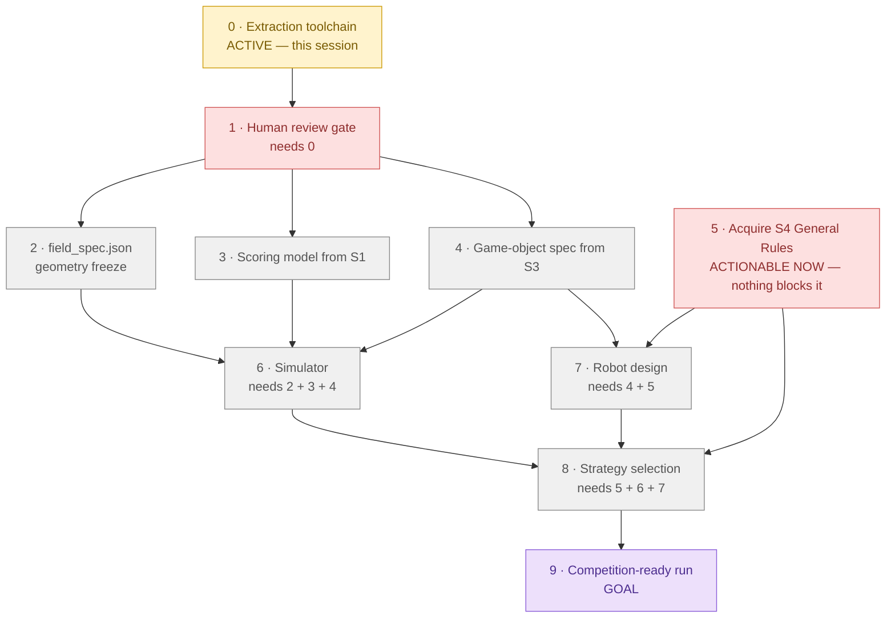

# WRO 2026 RoboMission Elementary — Roadmap

`last_reviewed: 2026-07-25`

## 0 · At a glance

| Phase | Status | What it is | Blocker |
|---|---|---|---|
| **0 · Extraction toolchain** | 🟡 ACTIVE | `tools/pdf_extract.py`, `docs/extracted/`, `docs/EXTRACTION_REPORT.md` | — |
| **1 · Human review gate** | 🟥 BLOCKED | read the extraction report; accept or reject geometry quality | operator only — needs 0 |
| **2 · `field_spec.json`** | ⬜ BLOCKED | freeze mat geometry; map fills → canonical area IDs; freeze the `CLAUDE.md` §5.3 ID table | needs 1 |
| **3 · Scoring model (S1)** | ⬜ BLOCKED | `CLAUDE.md` §5.6 frozen v1 → machine-readable; 24 note permutations | needs 1 |
| **4 · Object spec (S3)** | ⬜ BLOCKED | dimensions, mass, grip points per game object | needs 1 |
| **5 · Acquire S4** | 🟥 ACTIONABLE | obtain "WRO RoboMission General Rules 2026"; resolves A3, A4, A5, A6 | operator/external only — **nothing blocks it** |
| **6 · Simulator** | ⬜ BLOCKED | run/score simulation; exposes `moved_semantics` (A1) and `upright_tolerance_deg` (A2) | needs 2 **AND** 3 **AND** 4 |
| **7 · Robot design** | ⬜ BLOCKED | drivetrain, gripper, sensor layout | needs 4 **AND** 5 — A6 forbids starting without S4 |
| **8 · Strategy selection** | ⬜ BLOCKED | mission ordering, route planning, `P(success)` per path | needs 5, 6 **AND** 7 — anti-pattern #3 forbids claims without simulator evidence |
| **9 · Competition-ready run** | 🟪 GOAL | scored, repeatable run | needs 8 |

> **The only real bottlenecks are OPERATOR ACTIONS: (1) acquiring S4 — nothing in this repo
> can substitute it, and A6 hard-blocks robot design until it lands — and (2) the human
> review gate on extraction quality. There is no technical blocker anywhere: phases 2, 3
> and 4 fork cleanly the moment review clears, and S4 can be chased today, in parallel with
> everything else.**

### Why these edges

Drawn from stated constraints, not assumed ordering:

| Structure | Where | Source of the constraint |
|---|---|---|
| **Fork** | 1 → {2, 3, 4} | geometry, scoring rules and object specs come from three *different* sources (S2 / S1 / S3) and never read each other |
| **Join** | {2, 3, 4} → 6 | a simulator needs field geometry **and** a scoring model **and** object mass/dimensions |
| **Join** | {4, 5} → 7 | gripper design needs object dimensions (S3) **and** robot limits (S4); `CLAUDE.md` A6 |
| **Join** | {5, 6, 7} → 8 | `CLAUDE.md` §5.7 anti-pattern #3; A3/A4/A5 change scoring at time-out, so strategy conclusions are provisional until S4 lands |
| **Independent root** | 5 | S4 acquisition is external/operator work — it waits on nothing in this repo |
| **Gate** | 0 → 1 | session brief §6: extraction quality must be human-reviewed before geometry is frozen |

---

## 1 · Maintenance rule (living document)

Any task that closes or materially advances a phase **must reconcile this document in the
same unit of work** — the at-a-glance diagram classes, the phase table row, and
`last_reviewed`. Not as a follow-up, not "next session".

This is documentation-currency for decisions already made or explicitly authorized. It never
licenses making a new, undiscussed decision — if a change would require a *new* decision,
surface it and wait.

---

## 2 · Phase detail

### Phase 0 — Extraction toolchain 🟡 ACTIVE

Build `tools/pdf_extract.py` and turn S1/S2/S3 into machine-readable, human-reviewable
artifacts. Deliverables: the CLI, `tests/test_pdf_extract.py`, `docs/extracted/**`,
`docs/EXTRACTION_REPORT.md`, `docs/ASSUMPTIONS.md`.

Explicitly out of scope: `data/field_spec.json`, fill-colour → area-ID mapping, robot
design, strategy, simulator.

### Phase 1 — Human review gate 🟥

A person reads `docs/EXTRACTION_REPORT.md` and decides whether the extraction is trustworthy
enough to freeze geometry against. This gate exists because a wrong coordinate transform
produces output that looks entirely plausible.

### Phase 2 — `data/field_spec.json` ⬜

Freeze mat geometry in the MAT frame. Map the raw fill-colour inventory to canonical area
IDs — a judgement call deferred here on purpose. Freeze the `CLAUDE.md` §5.3 ID table in the
same commit.

### Phase 3 — Scoring model from S1 ⬜

Turn `CLAUDE.md` §5.6 into machine-readable rules, including the 4! = 24 note permutations
and 50 % partial credit on every mission.

### Phase 4 — Game-object spec from S3 ⬜

Per-object dimensions, mass and grip points from the building instructions.

### Phase 5 — Acquire S4 🟥 ACTIONABLE NOW

Obtain "WRO RoboMission General Rules 2026". Authoritative for robot limits, run procedure,
restarts, tie-break and table setup. Resolves A3, A4, A5, A6 and every open
`NEEDS-VERIFY(S4)` in `docs/EXTRACTION_REPORT.md`.

**This is the highest-leverage item on the board and it is blocked by nothing.**

### Phase 6 — Simulator ⬜

Run/score simulation over the frozen field spec. Exposes `moved_semantics` (A1) and
`upright_tolerance_deg` (A2) as parameters rather than baking in either reading.

### Phase 7 — Robot design ⬜

Drivetrain, gripper, sensor layout. **A6 forbids a final design before S4 is in hand.**

### Phase 8 — Strategy selection ⬜

Mission ordering and route planning, each candidate reported with `P(success)` — never a bare
maximum score (§5.7 anti-patterns #3 and #5).

### Phase 9 — Competition-ready run 🟪 GOAL
