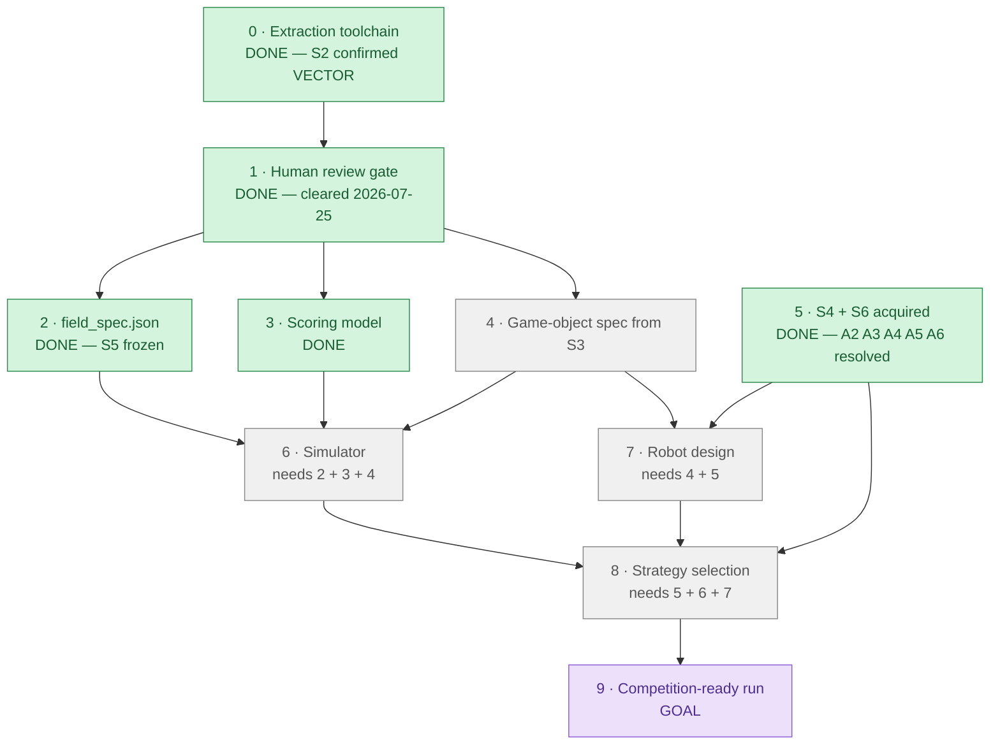

# WRO 2026 RoboMission Elementary — Roadmap

`last_reviewed: 2026-07-25` · **S4 and S6 acquired — phase 5 CLOSED.**

## 0 · At a glance

| Phase | Status | What it is | Blocker |
|---|---|---|---|
| **0 · Extraction toolchain** | ✅ DONE | `tools/pdf_extract.py` (45 tests green), `docs/extracted/` for all 3 sources, `docs/EXTRACTION_REPORT.md`. **S2 confirmed VECTOR** (50,479 paths); mat measured **2361.999 × 1143.000 mm**; two runs byte-identical across 9,124 outputs | — |
| **1 · Human review gate** | ✅ DONE | extraction accepted 2026-07-25 | — |
| **2 · `field_spec.json`** | ✅ **DONE** | **S5 built** by `tools/build_field_spec.py` from `docs/area_map.toml` — no hand-written coordinates. 17 areas (10 scoring), 6 note starts, 17 object start poses. Full-chain determinism verified. | — |
| **3 · Scoring model (S1)** | ✅ **DONE** | `data/scoring_model.json` — missions, predicates, time rules, randomization. Maxima sum to 255 and `max == each × count` per rule, both tested. | — |
| **4 · Object spec (S3)** | 🔵 **READY — re-scoped** | S4 §7.4: elements are WRO Brick Set 45811/45819 ⇒ LEGO geometry is a constant. **Count studs × 8.0 mm** rather than measure rasters | none — much cheaper than believed |
| **5 · S4 + S6** | ✅ **DONE** | S4 Jan 15 2026 (31 pp) + S6 snapshot acquired 2026-07-25; A2/A3/A4/A5/A6 resolved; 43 rules cited in `docs/citations.json` | — |
| **6 · Simulator** | ⬜ BLOCKED | run/score simulation; exposes `moved_semantics` (A1) and `upright_tolerance_deg` (A2). **Parameter acquisition can run in PARALLEL with phase 4** — see `docs/FIELD_TEST_PLAN.md`; only test P5 needs phase 4's objects | needs 2 **AND** 3 **AND** 4 |
| **7 · Robot design** | ⬜ BLOCKED | drivetrain, gripper, sensor layout. Budget: **4 motors**, 2 left after differential drive; cameras **prohibited** | **dependency set reduced to {4}** — it needs 4 AND 5; 5 is DONE, 4 has not run |
| **8 · Strategy selection** | ⬜ BLOCKED | mission ordering; EV is `P(success)×pts − P(collision)×40` — the bonus 40 is a **floor** | needs 6 AND 7 |
| **9 · Competition-ready run** | 🟪 GOAL | scored, repeatable run | needs 8 |

> **Phases 0, 1, 2, 3 and 5 are DONE.** Both original bottlenecks are cleared. S4 and S6 are in hand and the review gate has
> passed. The single remaining blocker is a **sign-off on three schema decisions**
> (ADR-013/014/015) whose consequences outlive this session — they are otherwise decided
> implicitly by whoever writes the builder. Phase 4 is now the cheapest it will ever be
> (count studs, do not measure rasters) and is **READY with nothing blocking it**.

### Why these edges

Drawn from stated constraints, not assumed ordering:

| Structure | Where | Source of the constraint |
|---|---|---|
| **Fork** | 1 → {2, 3, 4} | geometry, scoring rules and object specs come from three *different* sources (S2 / S1 / S3) and never read each other |
| **Join** | {2, 3, 4} → 6 | a simulator needs field geometry **and** a scoring model **and** object mass/dimensions |
| **Join** | {4, 5} → 7 | gripper design needs object dimensions (S3) **and** robot limits (S4); `CLAUDE.md` A6 |
| **Join** | {5, 6, 7} → 8 | `CLAUDE.md` §5.7 anti-pattern #3; A3/A4/A5 change scoring at time-out, so strategy conclusions are provisional until S4 lands |
| **Independent root** | 5 | S4 acquisition is external/operator work — it waits on nothing in this repo |
| **Gate** | 0 → 1 | session brief §6: extraction quality must be human-reviewed before geometry is frozen |

---

## 1 · Maintenance rule (living document)

Any task that closes or materially advances a phase **must reconcile this document in the
same unit of work** — the at-a-glance diagram classes, the phase table row, and
`last_reviewed`. Not as a follow-up, not "next session".

This is documentation-currency for decisions already made or explicitly authorized. It never
licenses making a new, undiscussed decision — if a change would require a *new* decision,
surface it and wait.

---

## 2 · Phase detail

### Phase 0 — Extraction toolchain ✅ DONE (2026-07-25)

Delivered: `tools/pdf_extract.py`, `tests/test_pdf_extract.py` (45 tests green),
`docs/extracted/**` for all three sources, `docs/EXTRACTION_REPORT.md`,
`docs/ASSUMPTIONS.md`.

Findings that change what downstream phases can assume:

| Finding | Effect |
|---|---|
| **S2 is VECTOR** — 50,479 paths, 0.9998 paths per painting op | phase 2 can be mm-exact; geometry is not sampling-limited |
| **Mat = 2361.999 × 1143.000 mm** from TrimBox | the `2362 × 1143` assumption is confirmed, not assumed |
| **S2 has zero bleed** (TrimBox == MediaBox) | raised a new `NEEDS-VERIFY(S4)` about a physical mat border — see phase 5 |
| **S3 is fully rasterized** — 1/177 pages with a text layer, 0 vector paths | phase 4 is visual-reading work, not parsing work. Budget accordingly. |
| S1 text + scoring tables extract cleanly (13,596 chars, GFM tables) | phase 3 is straightforward |
| S1 p13 confirms `AMBIGUITY(A1)` verbatim | the register's OR default stands |

Explicitly out of scope and **not** done: `data/field_spec.json`, fill-colour → area-ID
mapping, robot design, strategy, simulator.

### Phase 1 — Human review gate 🟥 ACTIVE

A person reads `docs/EXTRACTION_REPORT.md` and decides whether the extraction is trustworthy
enough to freeze geometry against. This gate exists because a wrong coordinate transform
produces output that looks entirely plausible.

### Phase 2 — `data/field_spec.json` ⬜

Freeze mat geometry in the MAT frame. Map the raw fill-colour inventory to canonical area
IDs — a judgement call deferred here on purpose. Freeze the `CLAUDE.md` §5.3 ID table in the
same commit.

### Phase 3 — Scoring model from S1 ⬜

Turn `CLAUDE.md` §5.6 into machine-readable rules, including the 4! = 24 note permutations
and 50 % partial credit on every mission.

### Phase 4 — Game-object spec from S3 🔵 READY — re-scoped

S4 §7.4: the 2026 game elements are built from the **WRO Brick Set (45811)** and **Expansion
Set (45819)**. They are therefore LEGO System/Technic, whose geometry is a known constant —
8.00 mm stud pitch, 3.2 mm plate, 9.6 mm brick.

Dimensions are obtained by **counting studs in a page render and multiplying by 8.0**, which
is robust to raster resolution in a way measuring is not. S3 being rasterized costs far less
than the extraction report assumed.

`MEASURED(S2):` the mat uses a design unit **u = 31.9 mm**, hit six independent times
(note start square 1.0u · target inner 1.5u · target outer 2.5u · grey border 0.5u ·
mic target 2.5 × 3.0u · cable area 2.5 × 6.5u). `ASSUME:` u ≈ 4 studs (32.0 mm, 0.31 % under,
consistently).

### Phase 5 — S4 + S6 ✅ DONE (2026-07-25)

Obtain "WRO RoboMission General Rules 2026". Authoritative for robot limits, run procedure,
restarts, tie-break and table setup. Resolves A3, A4, A5, A6 and every open
`NEEDS-VERIFY(S4)` in `docs/EXTRACTION_REPORT.md`.

Phase 0 added one more, and it is the highest-consequence of the set:

> Does the competition-supplied mat carry a **border beyond the artwork trim edge**, and is
> it laid flush to the table walls? S2 declares zero bleed, so if the physical mat has an
> unprinted margin, **every** MAT-frame coordinate is offset by a constant that no internal
> consistency check could reveal. (`AS-5`)

**Closed.** S4 verified (cover `VERSION: JANUARY 15TH 2026`, 31 pages,
sha256 `90a28d8b…9e795`) and an S6 snapshot taken (content `2026-06-30T16:45:33+02:00`).
43 rules are quoted and page-referenced in `docs/citations.json`.

S6 is **live and unversioned** and sits above S4 in the hierarchy — it has already overwritten
two S4 clauses. Re-read it before any scoring or robot-limit claim, at least weekly. Change
detection diffs the per-answer tuples in `docs/s6_index.json`, never the HTTP `Last-Modified`
header (a render/cache timestamp that moved to July while the content field stayed at 30 June).

**Still open at national scope:** `NEEDS-VERIFY(NO-TH)` — S4 §4.3/§5.2 let National Organizers
change robot limits. A6 is closed internationally, not locally.

### Phase 6 — Simulator ⬜

Run/score simulation over the frozen field spec. Exposes `moved_semantics` (A1) and
`upright_tolerance_deg` (A2) as parameters rather than baking in either reading.

### Phase 7 — Robot design ⬜

Drivetrain, gripper, sensor layout. **A6 forbids a final design before S4 is in hand.**

### Phase 8 — Strategy selection ⬜

Mission ordering and route planning, each candidate reported with `P(success)` — never a bare
maximum score (§5.7 anti-patterns #3 and #5).

### Phase 9 — Competition-ready run 🟪 GOAL
